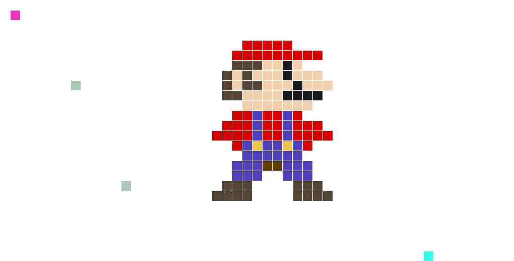

## Hi there, have fun vandalizing
Use this [Link](https://github.com/SRFklebth/SRFklebth/issues/new?title=pixel+update%3A+&body=Add+the+coordinates+x+y+and+the+hexcolour) to update the grid.
The title of the issue makes the colour on the grid.
Format: pixel update: x-coordinate y-coordinate hexvalue

## TODOs
-[ ] Make sure that all hexvalues work
-[ ] Adjust Grid to start at 1 1
-[ ] Change from json to a other format, maybe dictionary